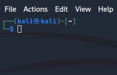
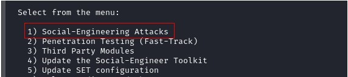
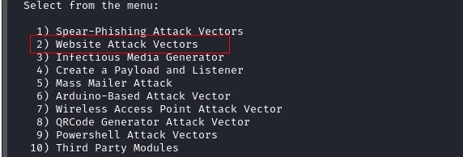
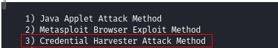
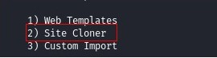
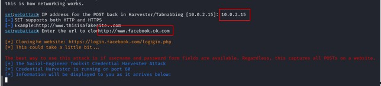
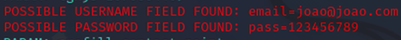

# Phishing
Ataque de Pshishing

Aqui são apresentados o passo a passo para se criar um tipo de ciberataque através do Kali Linux.

1. Após iniciar o Kali, abra uma janela do terminal:
   
   
2. Eleve o usuário para o perfil de root com o comando sudo su.
3. Abra o programa setoolkit
4. Selecione a opção: Social-Engineering Attacks

   
5. Depois escolha o vetor de ataque: Web Site Attack Vectors

   
6. Depois escolha o método de ataque: Credential Harvester Attack Method

    
7. Depois escolha a forma de ataque: Site Cloner

     
8. Digite o IP da sua máquina e 9. Defina o site que será clonado, no caso, o site http://www.facebook.com

    
10. Quando for tentado ser feito o login, a ferramenta irá capturar as credenciais:

    

